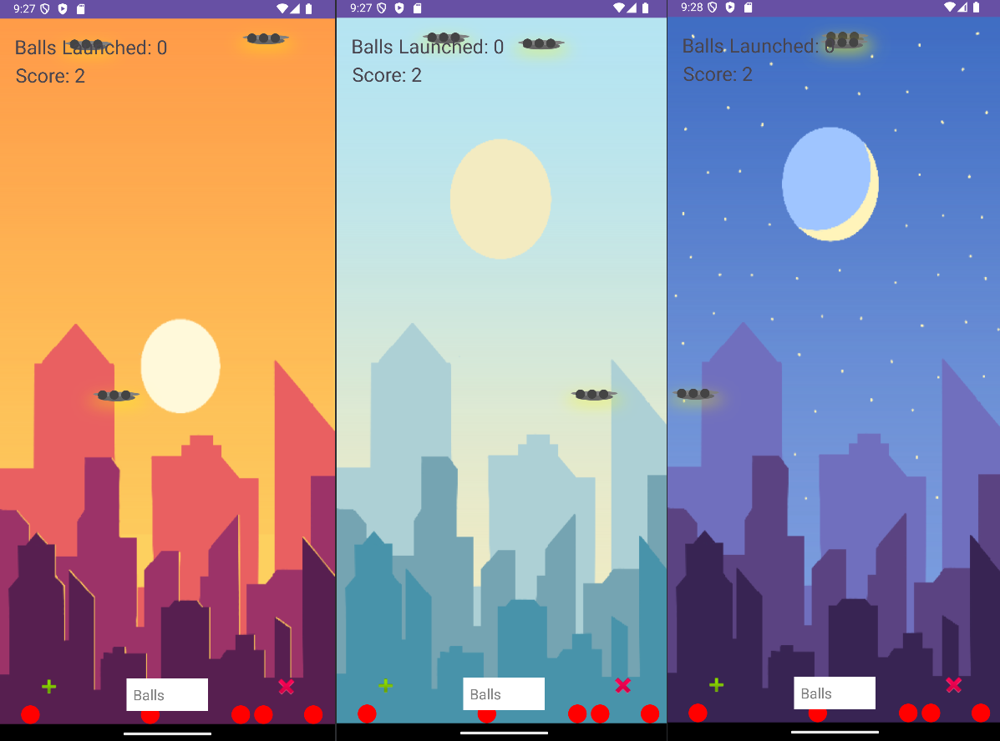

# Accelerometer UFO Ball Bounce Game

This project is an Android game that uses the device's accelerometer to control bouncing balls within a constrained area. The game includes multiple interactive features, such as dynamic background transitions, score tracking, and responsive collision detection with pads.

## Features

- **Accelerometer-Based Controls**: Use the device’s accelerometer to control ball movements in real-time.
- **Dynamic Background Transitions**: The background changes periodically among day, dusk/dawn, and night, creating a visually engaging experience.
- **Score Management**: Track scores based on successful pad collisions, with scores saved and loaded automatically.
- **Responsive UI**: Handles different screen sizes and orientations gracefully.
- **Persistent Game State**: Game state, including scores and balls launched, is saved locally and restored when the app is resumed.

## Technologies Used

- **Java**: Core programming language used for game logic, UI, and sensor integration.
- **Android SDK**: Provides access to Android-specific features like sensors and SharedPreferences.
- **Canvas API**: Used for drawing graphics, backgrounds, balls, and pads within the game.
- **SharedPreferences**: For saving and loading game state, including the number of balls launched and the score.
- **Accelerometer Sensor**: Controls the ball movement based on device orientation and movement.

## Project Structure

The project is organized as follows:

- `BackgroundManager`: Manages and cycles through the background images (day, dusk/dawn, and night) every 7 seconds.
- `Ball`: Represents each ball’s position, velocity, and behavior, including gravity and bouncing.
- `BallManager`: Manages multiple balls, updates their positions, applies acceleration, and handles drawing.
- `BouncingBallView`: Main game view that draws backgrounds, pads, and balls, handling interactions and accelerometer events.
- `Box`: Defines the boundaries within which the balls can bounce.
- `MainActivity`: Main entry point of the application, managing UI elements, sensor registration, and game state.
- `Pad`: Represents the moving pads that the balls can collide with, using a UFO-like design.
- `PadManager`: Manages a collection of pads, handles drawing, updates, and collision checks with balls.
- `ScoreManager`: Manages and saves the score, loading it when the game is resumed.

## How It Works

1. **Background Transitions**: `BackgroundManager` cycles through background images (day, dusk/dawn, night) to simulate a day-night cycle.
2. **Ball Physics**: `Ball` class uses gravity and damping to simulate realistic bouncing physics within defined boundaries (`Box`).
3. **Accelerometer Control**: `BouncingBallView` listens for accelerometer events and adjusts ball velocities based on device orientation.
4. **Collisions**: When balls collide with `Pad` objects, the score is incremented, and the ball's direction is reversed.
5. **Score Management**: `ScoreManager` saves the score using `SharedPreferences`, ensuring it persists across sessions.

## Setup

1. Clone the repository:
   ```bash
   git clone git@github.com:PatrickJamesRepo/AccelerometerBallBounce.git
